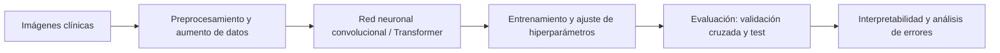

# Clasificador de enfermedades dermatológicas caninas mediante imágenes con redes neuronales profundas

Repositorio de **conceptos teóricos** del curso *Proyecto 2 (2027-1)*. Reúne los fundamentos necesarios para diseñar, entrenar y evaluar un clasificador de imágenes de lesiones de piel en perros usando *deep learning*.

> Este repositorio es de consulta teórica. Cada documento explica un concepto, por qué se usa en el proyecto y sus referencias.

## Objetivo del proyecto

Construir un modelo que, a partir de una fotografía de la piel de un perro, prediga la enfermedad dermatológica más probable (por ejemplo: dermatitis, sarna, infección fúngica, hipersensibilidad, piel sana), y evaluar su desempeño de forma rigurosa.



## Estructura del repositorio

```
.
├── README.md
└── teoria/
    ├── 01-fundamentos/        # Redes neuronales, retropropagación, funciones de pérdida
    ├── 02-datos/              # Dataset, etiquetado, preprocesamiento, aumento, desbalance
    ├── 03-arquitecturas/      # CNN, ResNet, EfficientNet, ViT, transfer learning
    ├── 04-entrenamiento/      # Optimizadores, regularización, early stopping, hiperparámetros
    ├── 05-evaluacion/         # Métricas, validación cruzada, matriz de confusión
    │   ├── validacion-cruzada.md
    │   └── img/
    └── 06-interpretabilidad/  # Grad-CAM, análisis de errores, consideraciones éticas
```

Convenciones:

- Un archivo `.md` por concepto, nombrado en español y en minúsculas con guiones (`validacion-cruzada.md`).
- Las imágenes de cada tema van en su subcarpeta `img/`.
- Cada documento sigue la plantilla: **Definición → Propósito en el proyecto → Formulación → Procedimiento → Referencias**.

## Contenido

| # | Tema | Conceptos |
|---|---|---|
| 01 | Fundamentos | Perceptrón, MLP, funciones de activación, retropropagación, entropía cruzada, *softmax* |
| 02 | Datos | Adquisición y etiquetado de imágenes, partición train/val/test, normalización, *data augmentation*, clases desbalanceadas |
| 03 | Arquitecturas | Convolución y *pooling*, CNN, ResNet, EfficientNet, Vision Transformer, *transfer learning* y *fine-tuning* |
| 04 | Entrenamiento | SGD, Adam/AdamW, tasa de aprendizaje y *schedulers*, *weight decay*, *dropout*, *label smoothing*, *early stopping* |
| 05 | Evaluación | [Validación cruzada (K-fold)](teoria/05-evaluacion/validacion-cruzada.md), exactitud, precisión, *recall*, F1 macro, matriz de confusión, ROC-AUC |
| 06 | Interpretabilidad | Grad-CAM, análisis de errores, sesgos del dataset, uso responsable en veterinaria |

## Cómo contribuir

1. Crear el documento en la carpeta del tema correspondiente siguiendo la plantilla.
2. Citar las fuentes (libros, artículos) en la sección **Referencias**.
3. Actualizar la tabla de **Contenido** de este README con el enlace al documento.
