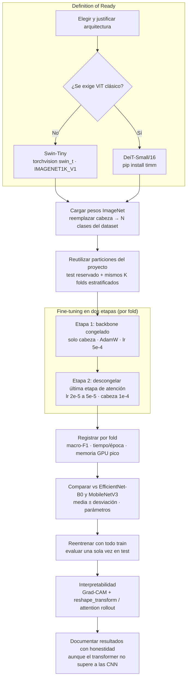

# Vision Transformer frente a CNN: Swin-Tiny y DeiT-Small

## 1. Definición

Un *transformer* de visión clasifica imágenes usando **autoatención** (*self-attention*) en lugar de convoluciones (Vaswani et al., 2017; Dosovitskiy et al., 2021). La imagen se divide en *patches* que se tratan como una secuencia de *tokens*; cada token puede relacionarse con los demás, de modo que el modelo captura dependencias globales desde las primeras capas.

A diferencia de una CNN, el transformer **no tiene sesgo inductivo de localidad ni de invariancia a la traslación** (Dosovitskiy et al., 2021; Raghu et al., 2021). Esto le da flexibilidad, pero exige más datos, regularización más fuerte o preentrenamiento para generalizar.

Se proponen dos variantes:

| Modelo | Idea clave | Fuente | Parámetros | Top-1 ImageNet |
|---|---|---|---|---|
| **Swin-Tiny** (principal) | Atención en ventanas locales desplazadas y jerarquía de resoluciones, similar a una CNN | Liu et al. (2021) · `torchvision.models.swin_t`, `IMAGENET1K_V1` | 28,3 M | 81,5 % |
| **DeiT-Small/16** (alternativa) | ViT clásico (atención global) con receta de entrenamiento eficiente en datos | Touvron et al. (2021) · `timm` | 22,1 M | 79,9 % |
| EfficientNet-B0 (referencia) | CNN escalada compuestamente | Tan & Le (2019) | 5,3 M | 77,7 % |
| MobileNetV3-Large (referencia) | CNN ligera para móviles | Howard et al. (2019) | 5,5 M | 74,0 % |

## 2. Propósito en el proyecto

Contrastar el paradigma *transformer* con las CNN ya usadas (EfficientNet-B0 y MobileNetV3) en el clasificador de enfermedades dermatológicas caninas, respondiendo:

1. ¿Mejora la macro-F1 un modelo basado en atención cuando el dataset es pequeño?
2. ¿Cuál es su costo en parámetros, tiempo de entrenamiento y memoria?
3. ¿Sus mapas de interpretabilidad señalan la lesión con la misma fidelidad que Grad-CAM en las CNN?

**Justificación de la elección (DoR):** se prefiere **Swin-Tiny** porque su atención por ventanas reintroduce localidad y jerarquía, lo que lo hace más robusto con pocos datos, y está disponible en `torchvision` sin dependencias extra (Liu et al., 2021). **DeiT-Small** se usa solo si se exige un ViT de arquitectura clásica; fue diseñado para entrenarse únicamente con ImageNet-1k, sin datos masivos (Touvron et al., 2021). En imágenes médicas, ambos paradigmas con preentrenamiento en ImageNet obtienen resultados comparables a las CNN (Matsoukas et al., 2021).

## 3. Formulación

**Autoatención** (Vaswani et al., 2017), con $Q = XW_Q$, $K = XW_K$, $V = XW_V$:

$$\mathrm{Attention}(Q,K,V) = \mathrm{softmax}\!\left(\frac{QK^\top}{\sqrt{d_k}}\right)V$$

**Costo computacional** para un mapa de $h \times w$ tokens con $C$ canales y ventanas de $M \times M$ (Liu et al., 2021):

$$\Omega(\text{MSA global}) = 4hwC^2 + 2(hw)^2C, \qquad \Omega(\text{W-MSA}) = 4hwC^2 + 2M^2hwC$$

La atención global (DeiT) es cuadrática en el número de tokens; la atención por ventanas (Swin) es lineal.

**Regularización** con AdamW, que desacopla el *weight decay* $\lambda$ del gradiente (Loshchilov & Hutter, 2019):

$$\theta_{t+1} = \theta_t - \eta\left(\frac{\hat{m}_t}{\sqrt{\hat{v}_t}+\epsilon} + \lambda\,\theta_t\right)$$

## 4. Procedimiento

### 4.1 Flujo de la actividad



### 4.2 Carga del modelo y reemplazo de la cabeza

```python
import torch.nn as nn
from torchvision.models import swin_t, Swin_T_Weights

weights = Swin_T_Weights.IMAGENET1K_V1
model = swin_t(weights=weights)
model.head = nn.Linear(model.head.in_features, num_classes)  # 768 → N
preprocess = weights.transforms()  # resize 232 bicúbico, crop 224, normalización ImageNet
```

Alternativa con `timm`:

```python
import timm
model = timm.create_model("deit_small_patch16_224.fb_in1k", pretrained=True, num_classes=num_classes)
```

### 4.3 Fine-tuning en dos etapas

Primero se entrena solo la cabeza para no distorsionar las características preentrenadas con gradientes de una cabeza aleatoria; después se ajusta la parte más profunda del backbone con una tasa menor (Howard & Ruder, 2018; Kumar et al., 2022).

| Etapa | Parámetros entrenables | Swin-Tiny (`torchvision`) | DeiT-Small (`timm`) |
|---|---|---|---|
| 1 | Cabeza | `model.head` | `model.head` |
| 2 | Cabeza + última etapa de atención | `model.features[7]`, `model.norm` | `model.blocks[-2:]`, `model.norm` |

```python
for p in model.parameters():
    p.requires_grad = False
for p in model.head.parameters():
    p.requires_grad = True
# ... entrenar etapa 1 ...

last_stage = list(model.features[7].parameters()) + list(model.norm.parameters())
for p in last_stage:
    p.requires_grad = True
optimizer = torch.optim.AdamW(
    [{"params": model.head.parameters(), "lr": 1e-4},
     {"params": last_stage, "lr": 2e-5}],
    weight_decay=0.05,
)
```

### 4.4 Hiperparámetros: régimen CNN frente a transformer

Los transformers necesitan tasas más bajas, *warmup*, más *weight decay* y aumentos más fuertes para compensar la falta de sesgo inductivo convolucional (Touvron et al., 2021; Steiner et al., 2022).

| Hiperparámetro | CNN (EfficientNet-B0 / MobileNetV3) | Transformer (Swin-T / DeiT-S) |
|---|---|---|
| Optimizador | Adam / AdamW | AdamW (Loshchilov & Hutter, 2019) |
| lr cabeza (etapa 1) | 1e-3 | 5e-4 |
| lr backbone (etapa 2) | 1e-4 | 2e-5 – 5e-5 |
| *Weight decay* | 1e-4 | 0,05 (sin aplicarlo a *bias* ni *LayerNorm*) |
| *Scheduler* | Coseno | Coseno con *warmup* lineal de 3–5 épocas (Goyal et al., 2017) |
| Aumentos | *Flip*, rotación, *color jitter* | Lo anterior + RandAugment (Cubuk et al., 2020), Random Erasing (Zhong et al., 2020), Mixup/CutMix (Zhang et al., 2018; Yun et al., 2019) |
| *Label smoothing* | 0,0 – 0,05 | 0,1 |
| Otros | — | *Gradient clipping* (norma 1,0), precisión mixta |

Los valores se toman como punto de partida y se ajustan con la misma búsqueda por validación cruzada descrita en [validacion-cruzada.md](../05-evaluacion/validacion-cruzada.md). En datasets pequeños conviene usar Mixup/CutMix con intensidad moderada ($\alpha \approx 0{,}2$–$0{,}4$).

### 4.5 Entrenamiento y comparación

- Usar **exactamente** la misma partición de test, los mismos índices de folds (misma semilla) y la misma métrica objetivo (macro-F1) que las CNN.
- Medir por fold:
	- Parámetros: `sum(p.numel() for p in model.parameters())`.
	- Tiempo por época: `time.perf_counter()` con `torch.cuda.synchronize()` antes de cada lectura.
	- Memoria GPU pico: `torch.cuda.reset_peak_memory_stats()` al inicio y `torch.cuda.max_memory_allocated()` al final.
- Reportar media ± desviación estándar en los $K$ folds y no extraer conclusiones de diferencias menores que la variabilidad entre folds (Bouthillier et al., 2021).

| Modelo | macro-F1 (media ± desv.) | Parámetros (M) | Tiempo/época (s) | Memoria GPU pico (GB) |
|---|---|---|---|---|
| EfficientNet-B0 | | 5,3 | | |
| MobileNetV3-Large | | 5,5 | | |
| Swin-Tiny | | 28,3 | | |

### 4.6 Interpretabilidad adaptada al transformer

Grad-CAM (Selvaraju et al., 2017) requiere un mapa espacial $C \times H \times W$. En los transformers la salida son tokens, por lo que se usa `reshape_transform` en `pytorch-grad-cam` (Gildenblat et al., 2021):

```python
from pytorch_grad_cam import GradCAM

# Swin-Tiny (torchvision): activaciones B×H×W×C → B×C×H×W
target_layers = [model.features[-1][-1].norm1]
swin_reshape = lambda t: t.permute(0, 3, 1, 2)

# DeiT-Small (timm): se descarta el token [CLS] y se reconstruye la grilla 14×14
# target_layers = [model.blocks[-1].norm1]
# deit_reshape = lambda t: t[:, 1:, :].reshape(t.size(0), 14, 14, t.size(2)).permute(0, 3, 1, 2)

cam = GradCAM(model=model, target_layers=target_layers, reshape_transform=swin_reshape)
```

Alternativa para DeiT: **atención acumulada** (*attention rollout*), que multiplica las matrices de atención de todas las capas para estimar cuánto aporta cada *patch* al token [CLS] (Abnar & Zuidema, 2020). Para una explicación más fiel por clase puede usarse el método de Chefer et al. (2021).

Comparar visualmente los mapas de Swin con los de las CNN en los mismos casos correctos y erróneos del conjunto de validación.

### 4.7 Discusión de despliegue

Parámetros y FLOPs no equivalen a latencia real; deben medirse en el hardware objetivo (Dehghani et al., 2022). Swin-Tiny tiene unas 5 veces más parámetros que EfficientNet-B0 o MobileNetV3 (~110 MB frente a ~20 MB en FP32), y MobileNetV3 fue diseñada para baja latencia en móviles (Howard et al., 2019). La discusión debe considerar:

- Tamaño del modelo en disco y en memoria.
- Latencia con batch 1 en CPU y GPU, tras un calentamiento.
- Si la posible ganancia en macro-F1 justifica el costo en un escenario de clínica veterinaria o aplicación móvil.

### 4.8 Reporte honesto

Si el transformer **no supera** a las CNN, se reporta igual. Con datasets pequeños, los ViT carecen del sesgo inductivo que favorece a las CNN y suelen necesitar más datos o regularización (Dosovitskiy et al., 2021; Steiner et al., 2022); ese hallazgo es un aporte válido y esperable.

## Referencias

- Abnar, S., & Zuidema, W. (2020). Quantifying attention flow in transformers. *Proceedings of the 58th Annual Meeting of the ACL*, 4190–4197. https://arxiv.org/abs/2005.00928
- Bouthillier, X., Delaunay, P., Bronzi, M., et al. (2021). Accounting for variance in machine learning benchmarks. *Proceedings of Machine Learning and Systems (MLSys)*, 3. https://arxiv.org/abs/2103.03098
- Chefer, H., Gur, S., & Wolf, L. (2021). Transformer interpretability beyond attention visualization. *Proceedings of CVPR*, 782–791. https://arxiv.org/abs/2012.09838
- Cubuk, E. D., Zoph, B., Shlens, J., & Le, Q. V. (2020). RandAugment: Practical automated data augmentation with a reduced search space. *CVPR Workshops*, 702–703. https://arxiv.org/abs/1909.13719
- Dehghani, M., Arnab, A., Beyer, L., Vaswani, A., & Tay, Y. (2022). The efficiency misnomer. *ICLR 2022*. https://arxiv.org/abs/2110.12894
- Dosovitskiy, A., Beyer, L., Kolesnikov, A., et al. (2021). An image is worth 16x16 words: Transformers for image recognition at scale. *ICLR 2021*. https://arxiv.org/abs/2010.11929
- Gildenblat, J., et al. (2021). *PyTorch library for CAM methods* [software]. https://github.com/jacobgil/pytorch-grad-cam
- Goyal, P., Dollár, P., Girshick, R., et al. (2017). Accurate, large minibatch SGD: Training ImageNet in 1 hour. https://arxiv.org/abs/1706.02677
- Howard, A., Sandler, M., Chu, G., et al. (2019). Searching for MobileNetV3. *Proceedings of ICCV*, 1314–1324. https://arxiv.org/abs/1905.02244
- Howard, J., & Ruder, S. (2018). Universal language model fine-tuning for text classification. *Proceedings of ACL*, 328–339. https://arxiv.org/abs/1801.06146
- Kumar, A., Raghunathan, A., Jones, R., Ma, T., & Liang, P. (2022). Fine-tuning can distort pretrained features and underperform out-of-distribution. *ICLR 2022*. https://arxiv.org/abs/2202.10054
- Liu, Z., Lin, Y., Cao, Y., et al. (2021). Swin Transformer: Hierarchical vision transformer using shifted windows. *Proceedings of ICCV*, 10012–10022. https://arxiv.org/abs/2103.14030
- Loshchilov, I., & Hutter, F. (2019). Decoupled weight decay regularization. *ICLR 2019*. https://arxiv.org/abs/1711.05101
- Matsoukas, C., Haslum, J. F., Söderberg, M., & Smith, K. (2021). Is it time to replace CNNs with transformers for medical images? *ICCV Workshop on Computer Vision for Automated Medical Diagnosis*. https://arxiv.org/abs/2108.09038
- Raghu, M., Unterthiner, T., Kornblith, S., Zhang, C., & Dosovitskiy, A. (2021). Do vision transformers see like convolutional neural networks? *NeurIPS*, 34. https://arxiv.org/abs/2108.08810
- Selvaraju, R. R., Cogswell, M., Das, A., et al. (2017). Grad-CAM: Visual explanations from deep networks via gradient-based localization. *Proceedings of ICCV*, 618–626. https://arxiv.org/abs/1610.02391
- Steiner, A., Kolesnikov, A., Zhai, X., et al. (2022). How to train your ViT? Data, augmentation, and regularization in vision transformers. *Transactions on Machine Learning Research*. https://arxiv.org/abs/2106.10270
- Tan, M., & Le, Q. V. (2019). EfficientNet: Rethinking model scaling for convolutional neural networks. *Proceedings of ICML*, PMLR 97, 6105–6114. https://arxiv.org/abs/1905.11946
- Touvron, H., Cord, M., Douze, M., et al. (2021). Training data-efficient image transformers & distillation through attention. *Proceedings of ICML*, PMLR 139, 10347–10357. https://arxiv.org/abs/2012.12877
- Vaswani, A., Shazeer, N., Parmar, N., et al. (2017). Attention is all you need. *NeurIPS*, 30. https://arxiv.org/abs/1706.03762
- Wightman, R. (2019). *PyTorch Image Models (timm)* [software]. https://github.com/huggingface/pytorch-image-models
- Yun, S., Han, D., Oh, S. J., et al. (2019). CutMix: Regularization strategy to train strong classifiers with localizable features. *Proceedings of ICCV*, 6023–6032. https://arxiv.org/abs/1905.04899
- Zhang, H., Cisse, M., Dauphin, Y. N., & Lopez-Paz, D. (2018). mixup: Beyond empirical risk minimization. *ICLR 2018*. https://arxiv.org/abs/1710.09412
- Zhong, Z., Zheng, L., Kang, G., Li, S., & Yang, Y. (2020). Random erasing data augmentation. *Proceedings of AAAI*, 34(07), 13001–13008. https://arxiv.org/abs/1708.04896
