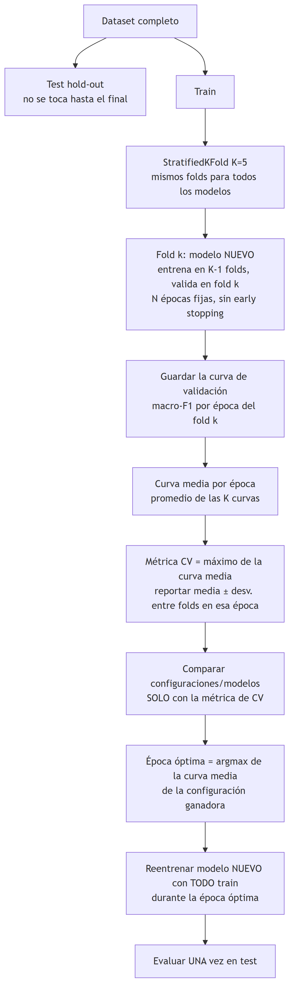

# Validación cruzada (K-fold)

## 1. Definición

La validación cruzada (*cross-validation*) es un método de remuestreo para **estimar cuánto generaliza un modelo**, es decir, cómo se comportará con datos que no vio durante el entrenamiento (Hastie et al., 2009, §7.10).

En su variante *K-fold*:
1. El conjunto de entrenamiento se divide en $K$ partes (*folds*) de tamaño similar.
2. En cada una de las $K$ iteraciones se entrena un **modelo nuevo** con $K-1$ folds y se evalúa con el fold restante.
3. Así, cada observación se usa exactamente una vez para validar.

En clasificación con clases desbalanceadas se usa la variante estratificada (*Stratified K-fold*), que mantiene en cada fold la misma proporción de clases que el conjunto original (Kohavi, 1995).

## 2. Propósito

**La validación cruzada no busca mejorar las métricas del modelo.** No cambia la arquitectura, los pesos ni los datos. Su propósito es **evaluar y decidir**:

1. **Estimar el rendimiento** de forma menos dependiente de una única partición entrenamiento/validación.
2. **Seleccionar el modelo o los hiperparámetros** (arquitectura, tasa de aprendizaje, número de épocas, etc.), comparando configuraciones con la misma métrica y los mismos folds.

## 3. Métrica reportada

El resultado se reporta como la media y la desviación estándar de la métrica en los $K$ folds (Hastie et al., 2009, §7.10):

$$\bar{m} = \frac{1}{K}\sum_{k=1}^{K} m_k, \qquad s = \sqrt{\frac{1}{K-1}\sum_{k=1}^{K}(m_k-\bar{m})^2}$$

- $\bar{m}$: rendimiento esperado del modelo.
- $s$: estabilidad del rendimiento según los datos con que se entrene.

## 4. Procedimiento y obtención del modelo final

El procedimiento sigue a Chollet (2021, §4.3):

1. Se separa un **conjunto de prueba** que no participa en ninguna decisión.
2. Con el conjunto de entrenamiento se aplica K-fold, entrenando cada fold durante un número fijo de épocas.
3. Se promedian las curvas de validación de los $K$ folds y se toma como **época óptima** la que maximiza la curva media.
4. Se comparan los modelos usando **solo** la métrica de validación cruzada.
5. El modelo final se **reentrena desde cero con todo el conjunto de entrenamiento** durante la época óptima.
6. Se evalúa **una sola vez** en el conjunto de prueba.

Si el conjunto de prueba se usara para elegir el modelo, la métrica reportada quedaría sesgada de forma optimista (Cawley & Talbot, 2010).

## 5. Cómo probar otros hiperparámetros con validación cruzada

Para comparar hiperparámetros sin sesgo, cada configuración debe evaluarse con **exactamente los mismos folds**.

1. Definir una grilla de combinaciones a evaluar, por ejemplo:
	- Tasa de aprendizaje: $[1\mathrm{e}{-4}, 3\mathrm{e}{-4}, 1\mathrm{e}{-3}]$
	- Tamaño de batch: $[16, 32]$
	- *Weight decay*: $[0, 1\mathrm{e}{-4}]$
	- *Label smoothing*: $[0.0, 0.05]$
2. Fijar la semilla y generar una sola vez los índices de los $K$ folds.
3. Para cada combinación de hiperparámetros:
	- Reiniciar el modelo desde cero.
	- Entrenar en los mismos $K$ folds.
	- Guardar la media y desviación estándar de la métrica objetivo (por ejemplo, macro-F1).
4. Elegir la combinación con mayor media; si dos son similares, preferir la de menor desviación estándar.
5. Reentrenar un modelo final con todos los datos de entrenamiento usando la configuración elegida.
6. Evaluar una sola vez en test para reportar desempeño final.

Ejemplo de estructura de resultados:

| lr | batch | weight decay | label smoothing | macro-F1 media | macro-F1 desviación |
|---|---|---|---|---|---|
| 1e-4 | 32 | 0 | 0.00 | 0.81 | 0.03 |
| 3e-4 | 32 | 1e-4 | 0.05 | 0.84 | 0.02 |
| 1e-3 | 16 | 1e-4 | 0.05 | 0.82 | 0.04 |

Buenas prácticas:

- Mantener fijo todo lo que no se está evaluando (arquitectura, augmentations, criterio, número máximo de épocas).
- Usar *early stopping* con la misma paciencia en todas las combinaciones.
- Evitar ajustar decisiones usando el conjunto de prueba.
- Si hay muchas combinaciones, comenzar con una búsqueda gruesa y luego refinar alrededor de las mejores.

## Referencias

- Cawley, G. C., & Talbot, N. L. C. (2010). On over-fitting in model selection and subsequent selection bias in performance evaluation. *Journal of Machine Learning Research*, 11, 2079–2107.
- Chollet, F. (2021). *Deep Learning with Python* (2.ª ed., §4.3). Manning. ([link](https://deeplearningwithpython.io/chapters/chapter04_classification-and-regression/#predicting-house-prices-a-regression-example))
- Hastie, T., Tibshirani, R., & Friedman, J. (2009). *The Elements of Statistical Learning* (2.ª ed., §7.10). Springer.
- Kohavi, R. (1995). A study of cross-validation and bootstrap for accuracy estimation and model selection. *Proceedings of IJCAI*, 1137–1145.